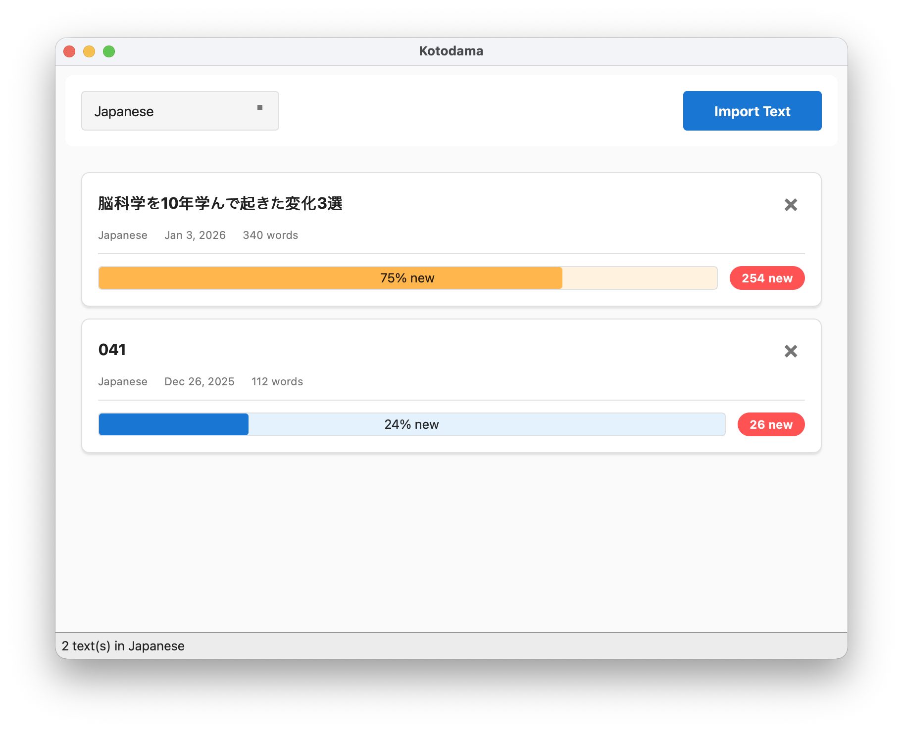
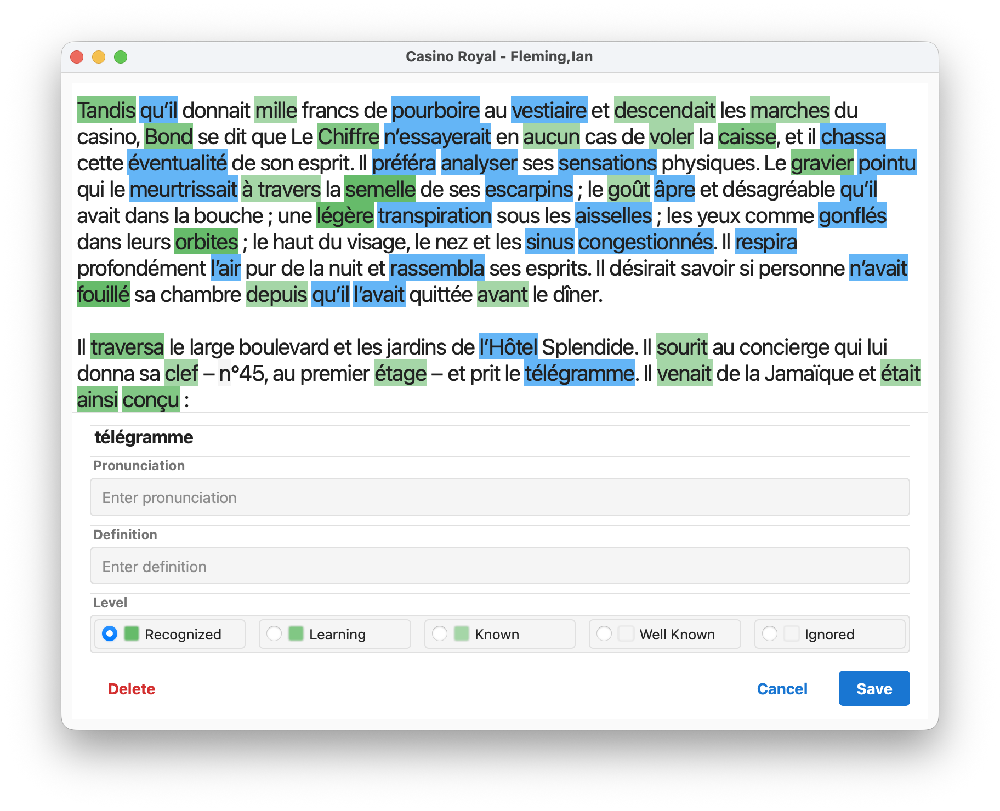

# Kotodama

A cross-platform language learning application built with Qt that helps you learn languages through reading texts with intelligent phrase matching and vocabulary tracking.

## Features

- **Text-based Learning**: Import and read texts in your target language
- **Smart Phrase Recognition**: Advanced trie-based algorithm for matching multi-word phrases
- **Vocabulary Management**: Track terms with learning levels (Recognized, Learning, Known, Well Known, Ignored)
- **Import/Export Vocabulary**: Import vocabulary lists from any CSV file
- **Intelligent Tokenization**: Language-specific text parsing for accurate word and phrase detection
- **Persistent Progress**: SQLite database stores your texts and vocabulary
- **Cross-Platform**: Runs on macOS, Windows, and Linux




## Installation

Pre-built installers for Windows and macOS are available in the [release](release/) directory.

## Prerequisites

- **Qt**: Version 5.x or 6.x (developed with Qt 6.10.1)
- **CMake**: Version 3.16 or higher
- **C++ Compiler**: Supporting C++17 standard
- **SQLite**: Included via Qt SQL module

## Building

### 1. Configure the Project

```bash
cmake -B build -S .
```

### 2. Build

```bash
cmake --build build
```

### 3. Run

**macOS:**
```bash
open build/kotodama.app
```

**Linux/Windows:**
```bash
./build/kotodama
```

## Testing

The project includes a comprehensive test suite using Google Test.

### Run All Tests

```bash
./run_tests.sh
```

### Run Tests Manually

```bash
cd build
ctest
```

### Run Specific Test

```bash
cd build
./tests/tst_tokenizer
```

## Architecture

Kotodama follows clean architectural patterns:

- **MVC Pattern**: Separation of UI (View), business logic (Model), and control flow
- **Singleton Managers**: Centralized data management for database, library, and terms
- **Trie Data Structure**: Efficient phrase matching for vocabulary recognition

### Project Structure

```
kotodama/
├── *.cpp/h              # Core application source files
├── tests/               # Google Test suite
├── CMakeLists.txt       # Build configuration
└── CLAUDE.md            # Developer documentation
```

### Key Components

- **UI Layer**: MainWindow, EbookViewer, dialogs for term editing and settings
- **Business Logic**: Models for text management and analysis
- **Data Management**: DatabaseManager, LibraryManager, TermManager
- **Core Utilities**: Tokenizer, TrieNode, LanguageConfig

## Development

See [CLAUDE.md](CLAUDE.md) for detailed developer documentation including:
- Code conventions and style guide
- Testing patterns and best practices
- Architecture details and design patterns
- Build troubleshooting

## Technology Stack

- **Framework**: Qt 6.10.1 (compatible with Qt 5.x)
- **Language**: C++17
- **Database**: SQLite via Qt SQL
- **Testing**: Google Test 1.14.0
- **Build System**: CMake 3.16+

## Version

Current version: **0.1** (Early Development)

## Planned Features

The following features are planned for future releases:

- **AI-Powered Definitions**: Automatic definition generation using AI
- Additional language support and customization options
- Enhanced statistics and progress tracking
- Mobile platform support

## Contributing

When contributing to Kotodama:

1. Follow the MVC pattern - keep UI and business logic separated
2. Write tests for new features
3. Use Qt classes for cross-platform compatibility
4. Maintain singleton pattern for manager classes
5. See [CLAUDE.md](CLAUDE.md) for detailed coding conventions

## Acknowledgments

Kotodama is inspired by these excellent language learning tools:

- [Foreign Language Text Reader](https://sourceforge.net/projects/foreign-language-text-reader/) - A tool for reading foreign language texts with vocabulary assistance
- [Learning With Texts](https://sourceforge.net/projects/learning-with-texts/) - A web-based tool for learning languages through reading

## License

This program is free software: you can redistribute it and/or modify it under the terms of the GNU General Public License as published by the Free Software Foundation, either version 3 of the License, or (at your option) any later version.

This program is distributed in the hope that it will be useful, but WITHOUT ANY WARRANTY; without even the implied warranty of MERCHANTABILITY or FITNESS FOR A PARTICULAR PURPOSE. See the GNU General Public License for more details.

You should have received a copy of the GNU General Public License along with this program. If not, see <https://www.gnu.org/licenses/>.

### Qt Framework

This application uses the Qt framework, which is available under the GNU Lesser General Public License (LGPL) version 3. For more information about Qt licensing, visit <https://www.qt.io/licensing/>.
