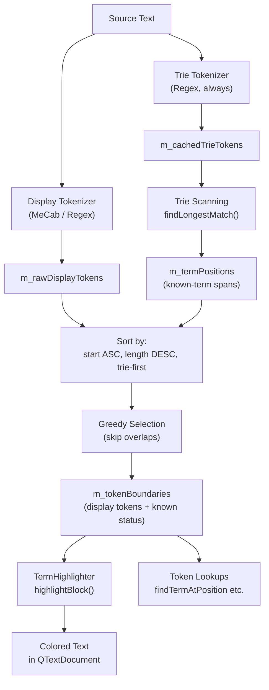
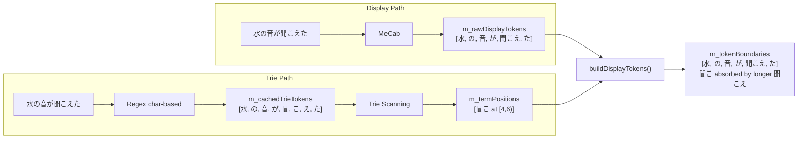
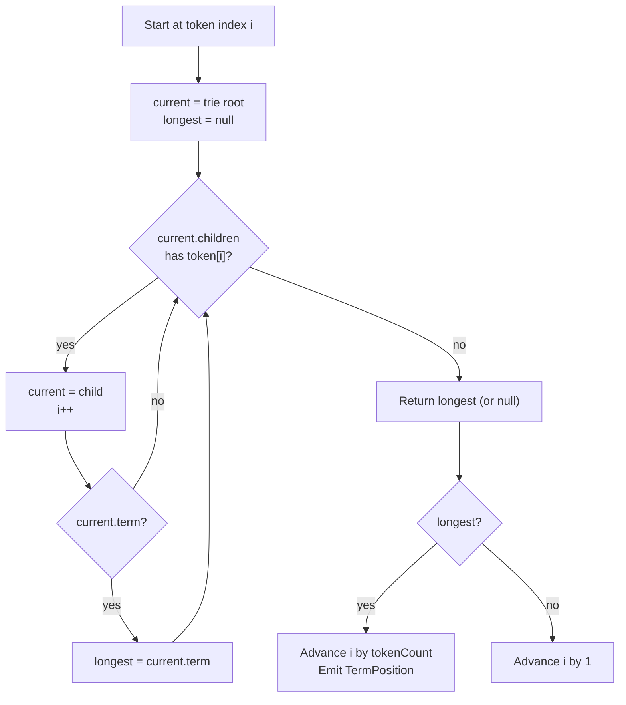
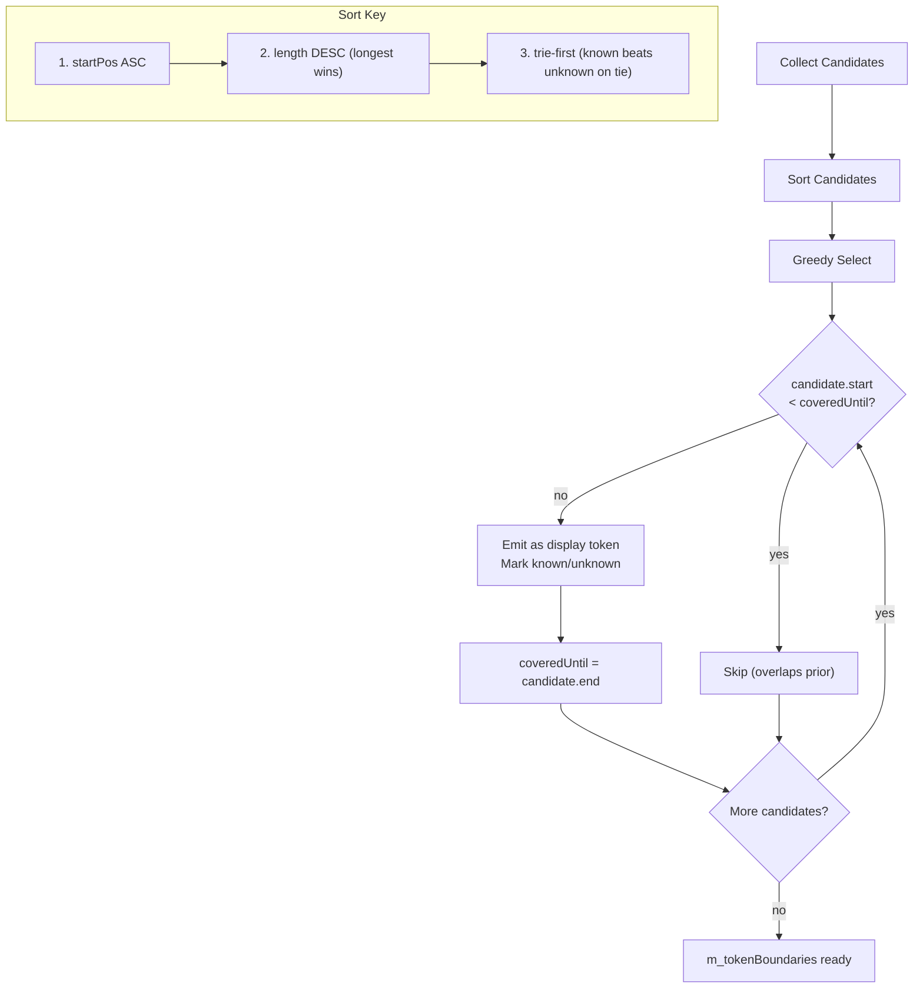
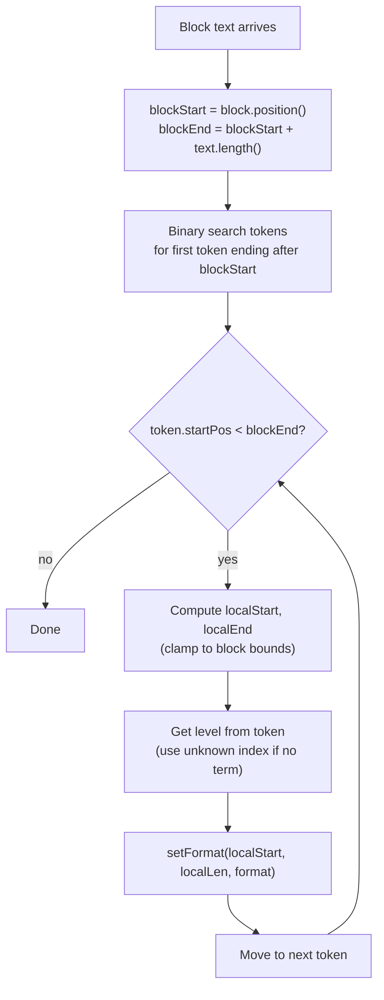
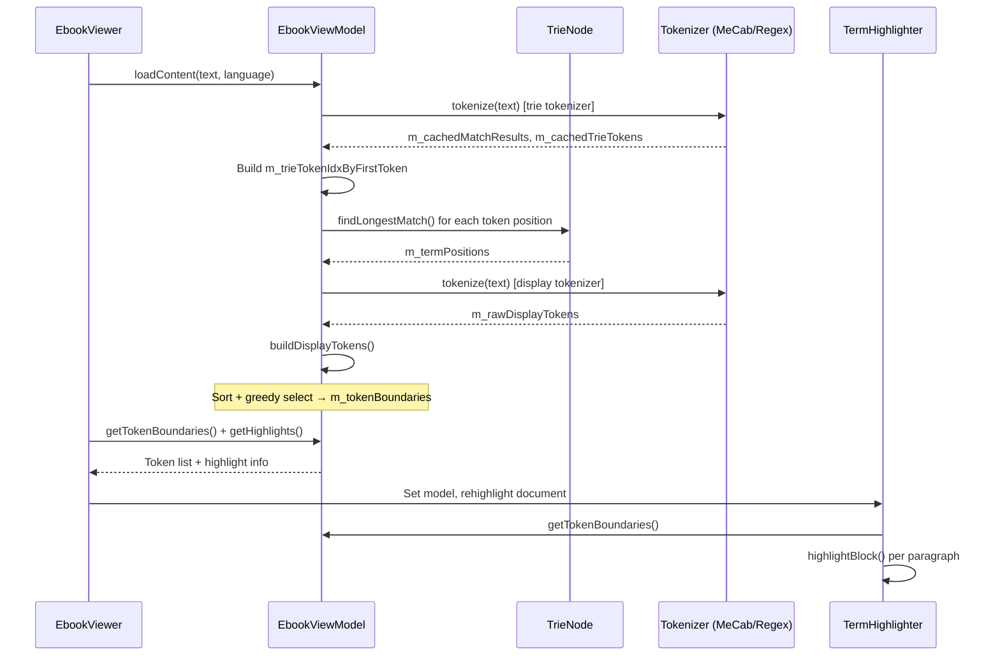

# Tokenization & Highlighting Algorithm

## Overview

Kotodama's text analysis uses **dual tokenization** — two independent tokenizers run on the same source text, producing output at different granularity levels. These outputs are then merged into a single **display-token layer** that feeds the syntax highlighter.

```
┌─────────────┐     ┌──────────────────┐     ┌─────────────────┐
│  Source     │     │  Dual            │     │  Display-Token  │
│  Text       │────▶│  Tokenization    │────▶│  Layer          │────▶ QSyntaxHighlighter
│             │     │  + Trie Matching │     │  (longest wins) │
└─────────────┘     └──────────────────┘     └─────────────────┘
```

## System Flow



## Dual Tokenizer Architecture

Two tokenizers with different purposes:

| Tokenizer | Purpose | Japanese | English |
|-----------|---------|----------|---------|
| **Display** | Determines visible token boundaries the user interacts with | MeCab (morphological) | Regex `[a-zA-Z]+` |
| **Trie** | Matches known phrases in the trie — always single characters or words | Regex char-based `[\p{Han}\p{Hiragana}\p{Katakana}]` | Regex word-based `[a-zA-Z]+` |

**Why two?** MeCab produces linguistically meaningful tokens (e.g., `聞こえ` as one verb morpheme), but the trie needs finer granularity to match multi-character known terms (e.g., `聞こ` as a 2-character substring). The display tokenizer determines what the user *sees* as tokens; the trie tokenizer determines what the trie *matches* against.



## Trie-Based Phrase Matching

### Trie Structure

Known terms are stored in a multi-way trie (not a radix tree — each node maps one token string to one child). The trie key is the Unicode-lowercased token text, using a fast-path (`toLowerTrieKey`) that avoids `QString::toLower()` when the token is already pure-ASCII-lowercase.

```
Insert "hello world" (2 tokens):
  root → "hello" → "world" → (Term*) → term = "hello world", tokenCount = 2

Insert "hello":
  root → "hello" → (Term*) → term = "hello", tokenCount = 1
```

### findLongestMatch Algorithm



### Tokenization Cache

To avoid re-tokenizing the full text on every term add/delete, the trie tokenizer output is cached:

| Cache Field | Purpose |
|-------------|---------|
| `m_cachedMatchResults` | `vector<TokenResult>` — full token list with byte positions |
| `m_cachedTrieTokens` | `vector<string>` — lowercased token text for trie lookup |
| `m_trieTokenIdxByFirstToken` | `unordered_map<string, vector<int>>` — inverted index for O(occurrences) term addition |

When a single term is added, `addTermPositions()` uses the inverted index to find all positions where the term's first token appears, then verifies the full token sequence — no full-text rescan needed.

## buildDisplayTokens(): The Core Merge Algorithm

This is the heart of the system. It merges raw display tokens and known-term positions into a single, non-overlapping display layer.



### Candidate Sources

1. **Raw display tokens** — from MeCab (Japanese) or word regex (other languages). Each carries the token text exactly as the display tokenizer produced it.
2. **Known-term positions** — from trie scanning. Text is extracted from the source on emission (`m_text.mid(start, end - start)`).

### Selection Rules

The greedy algorithm processes candidates in sort order:
- **Longest span always wins.** A MeCab token `聞こえ` [4,7) beats a known term `聞こ` [4,6) because 3 > 2 characters.
- **Equal-length ties:** known-term wins over raw MeCab token. This ensures a known term `学生` [2,4) beats MeCab's output of the same span.
- **Overlaps are skipped.** Once a span is emitted, `coveredUntil` advances, and any candidate whose start falls inside that region is dropped.

### Known/Unknown Status

A display token is **known** iff its `(startPos, endPos)` span exactly matches an entry in `m_termPositions` (checked via `m_termIdxByStartPos` hash map). Tokens that only partially overlap or don't match are **unknown**.

### Examples

**Case 1: Known term at end absorbed by longer MeCab token**

```
Text:     "一部"  (ichi-bu)
MeCab:    一部 [0,2)     ← one token
Trie:     部  [1,2)      ← known term
Result:   一部 [0,2) unknown    ← 部 absorbed, longest wins
```

**Case 2: Known term equals MeCab span**

```
Text:     "学生"  (gakusei)
MeCab:    学生 [0,2)     ← one token
Trie:     学生 [0,2)     ← known term
Result:   学生 [0,2) known     ← equal length, trie-first wins
```

**Case 3: Multi-word known term**

```
Text:     "say hello world now"
Display:  say [0,3), hello [4,9), world [10,15), now [16,19)
Trie:     hello world [4,15)   ← multi-word known term
Result:   say [0,3) unknown
          hello world [4,15) known    ← trie span longer than individual words
          now [16,19) unknown
```

## Term Highlighting

`TermHighlighter` extends `QSyntaxHighlighter` and colors text per-paragraph by matching display tokens against block boundaries.

### highlightBlock Algorithm



### Color Mapping

| TermLevel | Color | Foreground |
|-----------|-------|------------|
| Recognized (0) | Theme `LevelRecognized` | — |
| Learning (1) | Theme `LevelLearning` | — |
| Known (2) | Theme `LevelKnown` | — |
| WellKnown (3) | Theme `LevelWellKnown` | Brightness-adaptive (black/white) |
| Ignored (4) | Theme `LevelIgnored` | — |
| Unknown (no term) | Theme `LevelUnknown` | — |

### Incremental Re-highlighting

When a term is added or deleted via `addTermPositions`/`removeTermPositions`, the method returns a `vector<QPair<int,int>>` of changed character ranges. `rehighlightForRanges()` walks every text block touched by each range (not just first/last — spans of 3+ paragraphs need all middle blocks updated) and calls `rehighlightBlock()`.

## Chunked Term Matching

For large texts, trie scanning can block the UI. The model exposes chunked APIs that the viewer can drive incrementally via a QTimer:

```
beginChunkedTermMatching()    ← Prepare caches, reset scan state
          │
          ▼
    [QTimer loop]
          │
          ▼
processMatchChunk(N)          ← Process N tokens, store in m_pendingTermPositions
          │                   ← Returns true when all tokens processed
          ▼
commitTermMatches()           ← Move pending → m_termPositions
                              ← indexTermPositions() + buildDisplayTokens()
```

This allows the viewer to yield to the Qt event loop between chunks, keeping the application responsive while analyzing long documents.

## Data Flow Summary



## Key Design Decisions

1. **Dual tokenization** — MeCab for display quality, regex for trie matching granularity. The user sees linguistically valid tokens, but the trie matches at the character level needed for multi-character CJK phrases.

2. **Longest-span-wins merging** — Resolves the fundamental conflict between display tokenizer boundaries and known-term spans deterministically. A known term is only visible if its span survives the greedy selection. If it conflicts with a longer MeCab token, the MeCab token wins (the term is "absorbed"). This is correct because a display token represents a unit of interaction — showing a partial highlight inside a MeCab morpheme would confuse the user.

3. **Tokenization cache** — `m_cachedMatchResults` + inverted index enable O(occurrences) term add/delete instead of O(text) rescan, making vocabulary updates instantaneous.

4. **Per-paragraph highlighting** — Each `highlightBlock()` call binary-searches into the sorted token list. Since paragraphs are hundreds of bytes but tokens span the entire document, the binary search skips over out-of-scope tokens efficiently.

5. **Dependency injection** — `ILanguageProvider` and `ITermStore` interfaces decouple the model from singletons, enabling unit tests with mock trie data (see `InjectedTermStoreRecognizesTerms` test).
